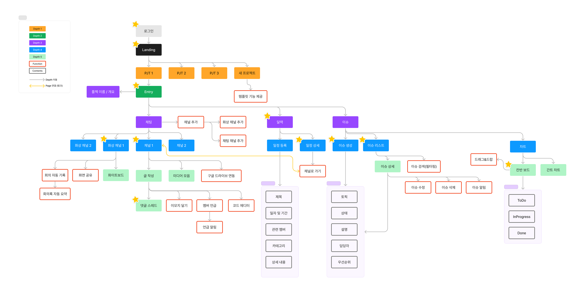
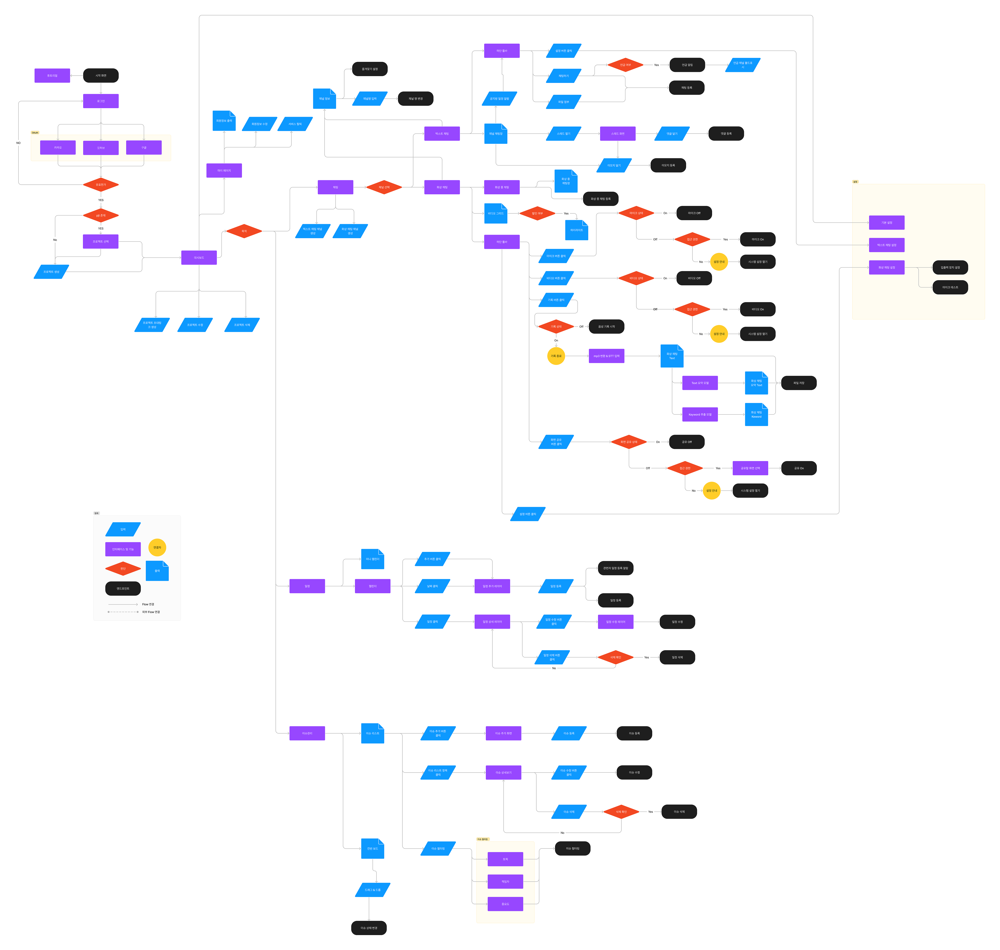
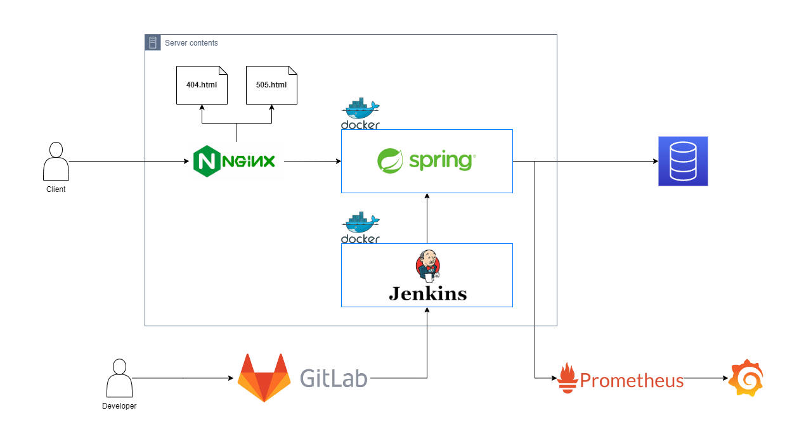
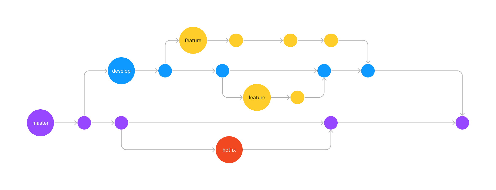

# Readme.md

**| 프로젝트 기간 |**  2023.07.10 -

**| 프로젝트 인원 |** 6명

**| Stack |**  SpringBoot, React, WebSocket, WebRTC

**| GitLab |**  [https://lab.ssafy.com/s09-webmobile1-sub2/S09P12A402](https://lab.ssafy.com/s09-webmobile1-sub2/S09P12A402)

&nbsp;  

### 📄 **Description**

---

**CoRookie는 웹 개발 초심자들을 위한 프로젝트 협업 툴입니다.** 

Notion, Slack, JIRA 등 분산되어 있는 개발 툴들을 통합하여 제공하는 All-In-One 협업 툴입니다.
협업 경험이 낯설고, 어떤 툴을 사용해야 할지 모르는 초보 개발자들이 
개발에 필요한 협업 프로세스를 익힐 수 있도록 도와줍니다.

&nbsp;

## 🛠 Skills
---
### Frontend

### Backend

### DevOps

### Collaboration

&nbsp;  

### 핵심 기능

---
|기능명|설명|
| -- |--|
|화상 채팅|화상 채팅을 통한 비대면 미팅 가능|
|스레드 채팅|스레드와 댓글 기능을 가진 채팅 기능|
|이슈 관리|프로젝트 진행을 위한 Task 관리 기능|
|일정 관리|팀원의 업무 미팅, 또는 사적 모임에 대한 일정 관리 기능|

&nbsp;  

### Information Architecture & Wireframe

---

&nbsp;  

### Work Flow

---

&nbsp;  

### System Architecture

---

&nbsp;  

## 🧑🏻‍💻 컨벤션

### 코딩 스타일 컨벤션
Google Java Convention

&nbsp;  

### CRUD 컨벤션

|  | Service | Repository | Controller |
| --- | --- | --- | --- |
| 생성 | create~ | save | ~Create |
| 삭제 | delete~ | delete | ~Delete |
| 수정 | modify~ | - | ~Modify |
| 조회 | find~ | find | ~List / ~Detail |

&nbsp;  

### Git 컨벤션

| Type | Description |
| --- | --- |
| feature | 새로운 기능 추가 |
| fix | 버그 수정 또는 typo |
| refactor | 리팩토링 |
| style | 코드 포맷팅, 세미콜론 누락, 코드 변경이 없는 경우 |
| docs | 문서를 수정한 경우 |
| test | 테스트(테스트 코드 추가, 수정, 삭제, 비즈니스 로직에 변경이 없는 경우) |
| chore | 위에 걸리지 않는 기타 변경사항(빌드 스크립트 수정, assets image, 패키지 매니저 수정 등) |
| hotfix | 긴급 수정 사항 |
| rename | 파일 혹은 폴더명을 수정하거나 옮기는 작업 만인 경우 |
| remove | 파일을 삭제하는 작업만 수행한 경우 |

&nbsp;  

### **브랜치 전략**

| 배포 | 개발 | 기능 | 긴급 수정 |
|:-:|:-:|:-:|:-:|
| master | develop | feature | hotfix |

- **작업 시작 시**: develop -> feature로 분기합니다.
- **작업 및 테스트 완료 시**: develop에 feature를 병합합니다.
- **상용 배포 시**: develop -> master로 병합합니다.

&nbsp;  

### **작성 규칙**

- commit message
  - ex) `feature: 카페 등록 기능 구현`

- branch

|branch|example|
|:-:|:-:|
|develop|`develop`|
|feature|`feature/{#issue-number}-[feature-name]`   `feature/#1`   `feature/#1-채팅생성`|
|hotfix|`hotfix`|

&nbsp;  

## 🧑‍🤝‍🧑 팀원 소개

---

<table>
      <tr align=center>
        <td><a href='https://lab.ssafy.com/gyqls234'>최효빈</a></td>
        <td><a href='https://lab.ssafy.com/btac3310'>서원호</a></td>
        <td><a href='https://lab.ssafy.com/imapples'>권현수</a></td>
        <td><a href='https://lab.ssafy.com/zaduc'>황상미</a></td>
        <td><a href='https://lab.ssafy.com/tmd0707'>신승수</a></td>
        <td><a href='https://lab.ssafy.com/sociojs85'>박종서</a></td>
      </tr>
        <tr align=center>
        <td>Leader, BE</td>
        <td>CTO</td>
        <td>FE</td>
        <td>FE</td>
        <td>BE</td>
        <td>BE</td>
      </tr>
    </table>

**최효빈 | 팀장, BE |**  스크럼 미팅 주관 및 프로젝트 CRUD 기능 구현

**서원호 | CTO |**  팀 내 테크 리드, 설계 및 구현 주도

**권현수 | FE |**  React 기반 페이지 구현 

**신승수 | BE |**  일정 기능 및 기계학습 모델 구현  

**박종서 | BE |**  SockJS 및 Stomp 활용 WebSocket 기반 텍스트 채팅 구현

**황상미 | FE |**  React 기반 페이지 구현

&nbsp;  
